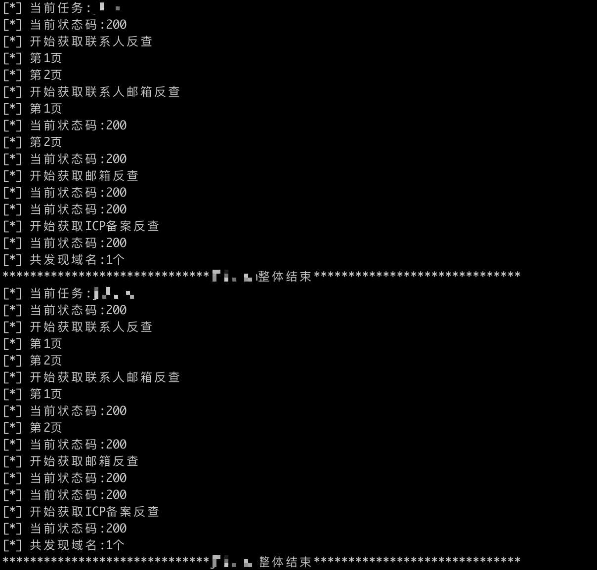

# WhoisSubodmain

> 通过Whois信息发现更多与目标有关联的域名，扩大攻击面。

## :bulb:描述
为什么想做这个?
在以往的渗透测试流程中，前期信息搜集是一个非常耗时的事情，如:目标有哪些子公司?目标对外有哪些投资?目标的母公司是什么?以这些为出发点开始思考，如何能"自动化"?，想了想还是慢慢的先把各个小点击破，另外一个出发点是应对XX行动，Let's do it

## 功能
- [x] 注册联系人反查
- [x] 注册邮箱反查
- [x] 注册联系人邮箱反查
- [x] 邮箱黑名单

注册联系人邮箱反查:  
在以往的渗透中发现反查联系人会有多个不同邮箱的情况，故该功能点产生

邮箱黑名单:  
包含常见的域名服务商，例如xinnet.com,ename.com等，主要减少噪音，如想要添加请修改chinaz.py内email_blacklist

## 如何使用
将目标一行一个放置根目录下url.txt内,最终输出程序根目录res.txt  

```
python3 main.py
```
## 运行截图



## 思考
做出来在告诉你 :-0  